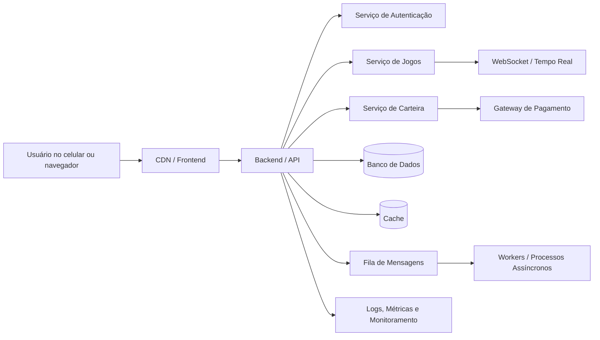

# Roteiro de Apresentação: Arquitetura e Engenharia de Software com o “Tigrinho”

**Público-alvo:** alunos de ETEC entre 15 e 18 anos  
**Tema:** panorama completo de como um sistema é desenhado, planejado e arquitetado  
**Estudo de caso fictício:** um cassino digital estilo “Tigrinho”  
**Tom:** didático, provocativo, com humor ácido e conscientização  
**Duração sugerida:** 60 a 90 minutos  
**Autor:** Manus AI

---

## 1. Ideia central da apresentação

A proposta desta apresentação é mostrar que **software não nasce pronto dentro do VS Code**. Antes de existir tela bonita, botão colorido, banco de dados ou deploy na nuvem, existe uma sequência de decisões técnicas, humanas, financeiras, legais e éticas. Arquitetura de software é justamente o campo que organiza essas decisões para que um sistema consiga funcionar, crescer, resistir a falhas e atender aos objetivos do negócio.

Para prender a atenção dos alunos, o exemplo usado será um produto fictício chamado **Tigrinho Supremo**, um cassino digital inspirado nos aplicativos de apostas que aparecem em propagandas suspeitas, vídeos curtos e promessas de “renda extra” que normalmente terminam com alguém vendendo o celular para pagar o prejuízo.

> **Aviso importante para abrir a apresentação:** o objetivo não é ensinar a criar um cassino real nem incentivar apostas. O objetivo é usar um exemplo polêmico para entender arquitetura de software, discutir responsabilidade técnica e mostrar como escolhas de engenharia podem afetar pessoas de verdade.

---

## 2. Objetivos de aprendizagem

Ao final da apresentação, os alunos devem compreender que arquitetar um sistema significa tomar decisões sobre **requisitos, usuários, dados, segurança, infraestrutura, comunicação, escalabilidade, manutenção, implantação e responsabilidade social**. Eles também devem perceber que escolher linguagem, banco de dados ou framework não é uma guerra religiosa, mas uma consequência do problema que se quer resolver.

| Objetivo | O que o aluno deve entender |
|---|---|
| Entender o papel da arquitetura | Arquitetura organiza as partes de um sistema e define como elas se comunicam. |
| Diferenciar requisitos funcionais e não funcionais | Nem tudo é “o que o sistema faz”; também importa como ele faz. |
| Conhecer componentes comuns de sistemas modernos | Frontend, backend, banco, cache, filas, APIs, WebSockets, cloud e CI/CD. |
| Perceber trade-offs | Toda decisão técnica resolve um problema e cria outro. |
| Refletir sobre ética | Sistemas de software podem ajudar, manipular, viciar, excluir ou prejudicar pessoas. |

---

## 3. Abertura: “Todo mundo quer fazer app, ninguém quer desenhar o encanamento”

**Tempo sugerido:** 5 minutos

Comece perguntando aos alunos:

> “Se eu pedisse para vocês criarem um app de cassino digital, qual seria a primeira coisa que vocês fariam?”

Provavelmente algumas respostas serão: criar a tela, escolher React, fazer login, programar o jogo, usar Firebase, criar banco de dados ou colocar uma imagem de tigre gritando. Use essas respostas para mostrar que a maioria das pessoas começa pela parte visível, mas sistemas reais dependem de muito mais.

Explique que software é como um prédio. A interface é a fachada. O código é a estrutura. O banco de dados é o arquivo morto que nunca pode pegar fogo. A nuvem é o terreno alugado. O CI/CD é a equipe de obra automatizada. E a arquitetura é o projeto que tenta impedir que tudo desabe na primeira promoção de “ganhe R$ 20 grátis”.

**Frase de impacto:**

> “Programar sem arquitetura é como construir um prédio começando pela pintura da parede. Fica bonito por três dias, até cair em cima de alguém.”

---

## 4. O estudo de caso: Tigrinho Supremo

**Tempo sugerido:** 5 minutos

Apresente o produto fictício:

O **Tigrinho Supremo** é uma plataforma digital de apostas com cadastro de usuários, carteira virtual, saldo em diferentes moedas, jogos em tempo real, promoções, notificações, ranking, histórico de transações, painel administrativo, antifraude, relatórios financeiros e suporte a múltiplos países.

O sistema parece simples para o usuário: ele entra, deposita dinheiro, aperta um botão, vê animações e perde o dinheiro com trilha sonora animada. Mas por trás da tela existe um conjunto enorme de decisões técnicas.

| Parte visível para o usuário | Complexidade escondida |
|---|---|
| Botão “Jogar” | Regras de jogo, geração de resultado, latência, logs e auditoria. |
| Saldo na tela | Carteira, transações, consistência, bloqueios e conciliação financeira. |
| Bônus de cadastro | Antifraude, regras promocionais e prevenção de abuso. |
| Ranking ao vivo | WebSockets, cache, filas e atualização em tempo real. |
| Saque | Verificação de identidade, compliance, gateways de pagamento e risco. |

Use esse momento para deixar claro que quanto mais “simples” um app parece, mais trabalho invisível provavelmente existe por trás.

---

## 5. Primeira etapa: entender o problema antes de escolher tecnologia

**Tempo sugerido:** 8 minutos

Antes de discutir React, Node, Java, Python, PostgreSQL ou AWS, a equipe precisa responder uma pergunta fundamental: **qual problema o sistema resolve e para quem?** No caso do Tigrinho Supremo, o problema de negócio seria oferecer jogos digitais com dinheiro real. Do ponto de vista técnico, isso cria desafios envolvendo segurança, dinheiro, tempo real, auditoria, escalabilidade e legislação.

Aqui entram os **requisitos funcionais** e **não funcionais**. Requisitos funcionais são aquilo que o sistema precisa fazer. Requisitos não funcionais são qualidades que o sistema precisa ter.

| Tipo de requisito | Exemplo no Tigrinho Supremo |
|---|---|
| Funcional | Criar conta, fazer login, depositar dinheiro, jogar, sacar, ver histórico. |
| Não funcional | Ser seguro, rápido, escalável, auditável, disponível e internacionalizado. |

Explique que muitos projetos falham porque só pensam nos requisitos funcionais. A equipe cria o botão de jogar, mas esquece de perguntar o que acontece se dez mil pessoas clicarem ao mesmo tempo, se o banco cair, se alguém tentar fraudar saldo, se o pagamento duplicar ou se um usuário abrir reclamação dizendo que sumiu dinheiro.

**Humor ácido com cuidado:**

> “Em sistema com dinheiro, bug não é só bug. Bug é um processo judicial com stack trace.”

---

## 6. Arquitetura geral: do navegador até a nuvem

**Tempo sugerido:** 10 minutos

Mostre uma visão de alto nível da arquitetura. A ideia é explicar que sistemas modernos normalmente são compostos por várias camadas que conversam entre si.

Explique em linguagem simples:

O **frontend** é a parte que o usuário vê. O **backend** concentra regras de negócio e segurança. O **banco de dados** guarda informações importantes. O **cache** acelera leituras frequentes. A **fila** permite processar tarefas demoradas sem travar o usuário. Os **WebSockets** permitem comunicação em tempo real. O **gateway de pagamento** conecta o sistema ao mundo financeiro. O **monitoramento** ajuda a descobrir problemas antes que os usuários descubram primeiro — e abram 400 reclamações no Reclame Aqui.

| Componente | Função | Exemplo prático |
|---|---|---|
| Frontend | Interface com o usuário | Tela de login, saldo, jogo e histórico. |
| Backend | Regras e segurança | Validar aposta, registrar transação e consultar saldo. |
| Banco de dados | Persistência | Usuários, apostas, transações e auditoria. |
| Cache | Velocidade | Ranking, sessões e dados consultados com frequência. |
| Fila | Processamento assíncrono | Enviar e-mail, processar saque, gerar relatório. |
| WebSocket | Tempo real | Atualizar ranking, jogo ao vivo e notificações. |
| Cloud | Infraestrutura | Hospedar servidores, banco, arquivos e rede. |
| CI/CD | Entrega automatizada | Testar e publicar novas versões com menos risco. |

---

## 7. Escolha de linguagens, frameworks e ferramentas

**Tempo sugerido:** 8 minutos

Explique que não existe linguagem perfeita. Existe linguagem adequada para um contexto, equipe, orçamento e prazo. Uma startup pode escolher tecnologias que acelerem desenvolvimento. Uma empresa financeira pode priorizar confiabilidade, auditoria e governança. Uma equipe pequena deve evitar uma arquitetura tão complexa que precise de 15 pessoas só para manter o “Hello World” respirando.

| Camada | Possíveis escolhas | Critério de decisão |
|---|---|---|
| Frontend web | React, Vue, Angular, Svelte | Experiência da equipe, comunidade, ecossistema e produtividade. |
| Mobile | React Native, Flutter, nativo | Custo, desempenho, acesso a recursos do dispositivo. |
| Backend | Node.js, Java, C#, Go, Python | Concorrência, desempenho, maturidade, bibliotecas e equipe. |
| Banco relacional | PostgreSQL, MySQL | Consistência, transações, consultas e confiabilidade. |
| Banco NoSQL | MongoDB, DynamoDB, Redis | Flexibilidade, escala, baixa latência ou chave-valor. |
| Mensageria | RabbitMQ, Kafka, SQS | Volume, ordem, confiabilidade e integração. |
| Cloud | AWS, Azure, Google Cloud, provedores locais | Custo, serviços disponíveis, compliance e equipe. |

Use uma analogia simples: escolher tecnologia é como escolher veículo. Uma bicicleta, uma moto, um ônibus e um caminhão são todos meios de transporte, mas servem para problemas diferentes. Usar Kubernetes para um projeto de TCC minúsculo pode ser como ir comprar pão de helicóptero.

**Frase de impacto:**

> “A melhor tecnologia é aquela que resolve o problema sem transformar a equipe em refém do próprio ego técnico.”

---

## 8. Modelagem de banco de dados: onde o dinheiro não pode virar fumaça

**Tempo sugerido:** 10 minutos

Mostre que banco de dados não é apenas “um lugar para salvar coisas”. Em sistemas com dinheiro, o banco precisa registrar transações de forma confiável, rastreável e consistente. O saldo do usuário não deveria ser apenas um número solto que alguém atualiza sem controle. O ideal é pensar em um modelo com **ledger**, isto é, um livro de registros financeiros.

Em vez de apenas guardar `saldo = 50`, o sistema registra eventos: depósito de R$ 100, aposta de R$ 10, prêmio de R$ 5, saque de R$ 45. O saldo pode ser calculado ou consolidado a partir desses registros.

| Entidade | O que representa | Exemplo de campos |
|---|---|---|
| Usuário | Pessoa cadastrada | id, nome, e-mail, país, status, data_criação. |
| Carteira | Conta financeira do usuário | id, usuário_id, moeda, saldo_disponível, saldo_bloqueado. |
| Transação | Movimento financeiro | id, carteira_id, tipo, valor, moeda, status, data. |
| Aposta | Jogada realizada | id, usuário_id, jogo_id, valor, resultado, data. |
| Auditoria | Registro de eventos sensíveis | id, ator, ação, ip, dados, data. |

Explique a diferença entre **saldo disponível** e **saldo bloqueado**. Se o usuário solicita um saque, talvez o valor fique bloqueado enquanto o sistema verifica fraude, identidade e pagamento. Isso evita que a pessoa saque e aposte o mesmo dinheiro ao mesmo tempo.

**Humor ácido:**

> “Se você tratar dinheiro como variável global, parabéns: você criou um caixa eletrônico possuído.”

---

## 9. Dinheiro, pagamentos e conciliação

**Tempo sugerido:** 8 minutos

Sistemas com dinheiro exigem cuidado especial. Um pagamento pode ser aprovado, recusado, ficar pendente, duplicar, expirar ou ser estornado. Além disso, o sistema interno precisa bater com o gateway de pagamento e com relatórios financeiros. Esse processo é chamado de **conciliação**.

Explique que o sistema precisa lidar com estados. Um depósito pode começar como `PENDENTE`, mudar para `APROVADO` ou `RECUSADO`. Um saque pode ser `SOLICITADO`, `EM_ANÁLISE`, `PAGO` ou `CANCELADO`.

| Estado | Significado |
|---|---|
| Pendente | O pagamento foi criado, mas ainda não confirmado. |
| Aprovado | O dinheiro foi confirmado pelo provedor de pagamento. |
| Recusado | O pagamento não foi aceito. |
| Estornado | O valor foi devolvido. |
| Em análise | Há verificação manual ou antifraude. |

Reforce que operações financeiras devem ser **idempotentes**. Isso significa que, se uma notificação de pagamento chegar duas vezes, o sistema não deve creditar o dinheiro duas vezes.

**Exemplo didático:**

Se o gateway envia duas notificações dizendo “pagamento aprovado”, o sistema precisa reconhecer que é o mesmo pagamento e processar apenas uma vez. Caso contrário, o usuário ganha saldo duplicado e a empresa ganha uma visita não planejada do departamento jurídico.

---

## 10. Internacionalização: o mundo não fala apenas “pt-BR”

**Tempo sugerido:** 6 minutos

Internacionalização, ou **i18n**, é preparar o sistema para funcionar em diferentes idiomas, moedas, fusos horários, formatos de data, regras legais e culturas. Não é apenas trocar “Entrar” por “Login”.

| Aspecto | Exemplo de problema |
|---|---|
| Idioma | Português, inglês, espanhol e textos com tamanhos diferentes. |
| Moeda | Real, dólar, euro, pesos e conversão cambial. |
| Data e hora | Formatos diferentes e fusos horários. |
| Legislação | Regras diferentes por país ou região. |
| Comunicação | Tom, mensagens, suporte e notificações. |

Explique que dinheiro nunca deve ser salvo de forma descuidada. O sistema deve considerar moeda, precisão decimal e regras de arredondamento. Também é comum armazenar valores monetários em centavos ou na menor unidade da moeda para evitar erros de ponto flutuante.

**Frase de impacto:**

> “Se você acha que internacionalização é só traduzir botão, espere até descobrir que 01/02/2026 pode ser janeiro ou fevereiro dependendo do país.”

---

## 11. WebSockets e tempo real: quando o usuário não quer apertar F5

**Tempo sugerido:** 6 minutos

Explique que muitas aplicações precisam atualizar dados em tempo real. Em um cassino digital fictício, isso poderia aparecer em rankings, notificações, salas ao vivo, status de pagamento, promoções relâmpago ou jogos multiplayer.

O modelo tradicional de API funciona como uma pergunta: o frontend pergunta e o backend responde. Já com **WebSocket**, a conexão permanece aberta, permitindo que servidor e cliente troquem mensagens continuamente.

| Modelo | Como funciona | Quando usar |
|---|---|---|
| HTTP tradicional | Cliente faz requisição e servidor responde. | Login, cadastro, histórico e consultas comuns. |
| Polling | Cliente pergunta de tempos em tempos. | Atualizações simples, quando tempo real não é crítico. |
| WebSocket | Conexão aberta entre cliente e servidor. | Chat, jogos, notificações e placares ao vivo. |

Use uma analogia: HTTP tradicional é mandar mensagem e esperar resposta. Polling é perguntar “já chegou?” a cada 5 segundos. WebSocket é ficar em ligação aberta.

**Humor ácido:**

> “Polling mal usado é uma criança no banco de trás perguntando ‘já chegou?’ até o servidor pedir demissão.”

---

## 12. Escalabilidade: e se todo mundo resolver perder dinheiro ao mesmo tempo?

**Tempo sugerido:** 8 minutos

Escalabilidade é a capacidade do sistema de lidar com aumento de uso. Um sistema pode funcionar bem com 100 usuários e entrar em colapso com 10 mil. Arquitetar é pensar antes no que pode virar gargalo.

| Gargalo | Possível solução |
|---|---|
| Muitas requisições no backend | Balanceamento de carga e múltiplas instâncias. |
| Banco sobrecarregado | Índices, réplicas de leitura, cache e particionamento. |
| Tarefas demoradas | Filas e processamento assíncrono. |
| Arquivos pesados | CDN e armazenamento de objetos. |
| Picos de acesso | Auto scaling e limites de uso. |

Explique escala vertical e horizontal. Escala vertical é colocar uma máquina mais forte. Escala horizontal é colocar várias máquinas trabalhando juntas. A vertical é como trocar um funcionário por um fisiculturista. A horizontal é contratar uma equipe. As duas têm custo e limite.

Também fale sobre **rate limiting**, que limita quantas requisições um usuário pode fazer em determinado período. Isso protege contra abuso, bots e ataques.

---

## 13. Cloud: o computador dos outros, com boleto mensal

**Tempo sugerido:** 7 minutos

A computação em nuvem permite usar servidores, bancos, armazenamento, redes e serviços gerenciados sem comprar infraestrutura física. Isso dá velocidade, elasticidade e alcance global, mas também traz custo, complexidade e dependência de fornecedor.

| Serviço de cloud | Função |
|---|---|
| Compute | Rodar aplicações em servidores, containers ou funções. |
| Database | Hospedar bancos gerenciados. |
| Storage | Guardar arquivos, imagens, documentos e backups. |
| CDN | Entregar conteúdo rápido para usuários em várias regiões. |
| Monitoring | Coletar métricas, logs e alertas. |
| Secrets | Guardar senhas, chaves e tokens com segurança. |

Explique que nuvem não é mágica. Se a arquitetura for ruim, ela apenas permite que o desastre seja distribuído globalmente com cobrança em dólar.

**Frase de impacto:**

> “Cloud é o computador dos outros. Escalabilidade é conseguir usar mais computadores dos outros. FinOps é descobrir que os outros mandam boleto.”

---

## 14. Segurança: porque sempre existe alguém tentando burlar o sistema

**Tempo sugerido:** 8 minutos

Segurança precisa ser pensada desde o começo. Em um sistema que envolve dinheiro, dados pessoais e login, ataques são esperados. Não é pessimismo; é maturidade.

| Risco | Exemplo | Mitigação |
|---|---|---|
| Roubo de conta | Senha vazada ou fraca | MFA, hash de senha, detecção de login suspeito. |
| Fraude financeira | Depósito falso ou saque abusivo | Antifraude, idempotência, auditoria e conciliação. |
| Manipulação de saldo | Alteração indevida de valores | Transações, permissões e logs imutáveis. |
| Ataques à API | Requisições excessivas ou maliciosas | Rate limiting, validação e WAF. |
| Vazamento de segredo | Chaves no código | Cofre de segredos e revisão de configuração. |

Explique conceitos simples: senha não deve ser salva em texto puro; permissões precisam ser controladas; dados sensíveis devem ser protegidos; logs não devem vazar informações pessoais; e toda ação importante deve deixar rastros auditáveis.

**Humor ácido:**

> “Salvar senha em texto puro é como deixar a chave de casa embaixo do tapete e postar o endereço no TikTok.”

---

## 15. Observabilidade: logs, métricas e rastreamento

**Tempo sugerido:** 5 minutos

Observabilidade é a capacidade de entender o que está acontecendo dentro do sistema. Quando algo dá errado, a equipe precisa saber onde, quando, por quê e com quem aconteceu.

| Instrumento | Pergunta que responde |
|---|---|
| Logs | O que aconteceu? |
| Métricas | Quanto aconteceu e com que frequência? |
| Traces | Por onde a requisição passou? |
| Alertas | Quando alguém precisa agir? |

Explique que em sistemas reais não basta dizer “deu erro”. É preciso saber se o erro ocorreu no frontend, na API, no banco, no gateway de pagamento ou em uma fila. Sem observabilidade, a equipe vira um grupo de detetives investigando um crime sem câmera, sem testemunha e sem corpo.

---

## 16. CI/CD: entregar sem transformar sexta-feira em filme de terror

**Tempo sugerido:** 7 minutos

CI/CD significa integração contínua e entrega ou implantação contínua. A ideia é automatizar etapas como testes, análise de código, build e deploy. Isso reduz o risco de publicar versões quebradas.

| Etapa | O que acontece |
|---|---|
| Commit | Desenvolvedor envia código. |
| Testes | Sistema roda testes automatizados. |
| Build | Aplicação é empacotada. |
| Deploy em staging | Versão vai para ambiente de teste. |
| Aprovação | Time valida se está tudo certo. |
| Deploy em produção | Versão chega aos usuários. |
| Rollback | Sistema volta versão anterior se algo falhar. |

Explique que deploy manual pode funcionar em projetos pequenos, mas em sistemas críticos vira risco. Se a equipe publica uma versão com bug no cálculo de saldo, o problema deixa de ser técnico e vira financeiro.

**Frase de impacto:**

> “Deploy na sexta-feira às 18h sem rollback é uma forma moderna de invocar demônios.”

---

## 17. Monólito, microsserviços e o perigo de complicar antes da hora

**Tempo sugerido:** 7 minutos

Explique que um **monólito** é uma aplicação em que muitas funcionalidades ficam em um único projeto. **Microsserviços** dividem o sistema em serviços menores e independentes. Nenhuma abordagem é automaticamente melhor.

| Abordagem | Vantagens | Desvantagens |
|---|---|---|
| Monólito | Simples de começar, testar e implantar. | Pode ficar difícil de manter se crescer sem organização. |
| Monólito modular | Mantém simplicidade com separação interna clara. | Exige disciplina arquitetural. |
| Microsserviços | Escala e deploy independentes por domínio. | Aumenta complexidade de rede, observabilidade, dados e operações. |

A recomendação didática é apresentar o **monólito modular** como ponto de partida saudável para muitos projetos. Ele permite organizar domínios como usuários, carteira, jogos, pagamentos e relatórios sem transformar o projeto em uma hidra de serviços antes de ter necessidade real.

**Humor ácido:**

> “Microsserviço sem equipe preparada é só um monólito que explodiu e espalhou sofrimento pela rede.”

---

## 18. Ética e responsabilidade: o software não é neutro

**Tempo sugerido:** 10 minutos

Este é um dos momentos mais importantes. Explique que engenharia de software não é apenas escolher tecnologia. Sistemas digitais influenciam comportamento. Um cassino digital pode usar notificações, bônus, cores, sons, rankings e recompensas para manter usuários engajados. Essas mesmas técnicas também podem manipular pessoas vulneráveis.

Use o estudo de caso para discutir decisões éticas:

| Decisão de produto | Pergunta ética |
|---|---|
| Notificação de “você está quase ganhando” | Isso informa ou manipula? |
| Bônus para quem perdeu dinheiro | Isso ajuda ou explora vulnerabilidade? |
| Saque difícil e depósito fácil | Isso é conveniência ou armadilha? |
| Ranking público | Isso cria diversão ou pressão social? |
| Anúncios para menores | Isso deveria existir? |

A mensagem principal é que desenvolvedores não são apenas “pessoas que implementam tickets”. Eles participam da criação de sistemas que podem afetar finanças, saúde mental, privacidade e segurança de usuários.

**Frase de encerramento dessa seção:**

> “Se o sistema lucra quando o usuário perde o controle, a arquitetura não é só técnica. Ela também é moral.”

---

## 19. Atividade rápida com a turma

**Tempo sugerido:** 8 a 12 minutos

Divida os alunos em grupos e apresente o seguinte desafio:

> “Vocês são a equipe de arquitetura do Tigrinho Supremo. O CEO quer lançar em 30 dias. O marketing quer bônus agressivo. O jurídico está preocupado. O financeiro quer evitar fraude. O suporte quer menos reclamações. O time técnico tem quatro pessoas. O que vocês priorizam?”

Cada grupo deve escolher cinco prioridades iniciais. Depois, peça que expliquem suas decisões.

| Prioridade possível | Por que pode ser importante |
|---|---|
| Autenticação segura | Evita roubo de contas. |
| Carteira transacional | Protege dinheiro e histórico. |
| Logs e auditoria | Permite investigar problemas. |
| Integração de pagamento | Viabiliza depósito e saque. |
| Limites e antifraude | Reduz abuso e risco financeiro. |
| Internacionalização | Permite expansão para outros países. |
| WebSockets | Melhora experiência em tempo real. |
| CI/CD | Reduz risco de entrega. |
| Monitoramento | Ajuda a detectar falhas rapidamente. |

O objetivo da atividade é mostrar que arquitetura envolve **priorização**. Não dá para fazer tudo ao mesmo tempo, especialmente com prazo curto e equipe pequena.

---

## 20. Roteiro sugerido de slides

| Slide | Título | Conteúdo principal |
|---|---|---|
| 1 | Arquitetura de Software: por trás do app bonitinho | Apresentação do tema e do estudo de caso. |
| 2 | Aviso: não estamos ensinando apostas | Contexto ético e objetivo educacional. |
| 3 | O que é arquitetura de software? | Organização, decisões e trade-offs. |
| 4 | Conheça o Tigrinho Supremo | Produto fictício e funcionalidades. |
| 5 | Parece simples, mas não é | Tabela entre interface visível e complexidade escondida. |
| 6 | Requisitos funcionais e não funcionais | Diferença e exemplos. |
| 7 | Visão geral da arquitetura | Diagrama de componentes. |
| 8 | Frontend, backend e APIs | Responsabilidades principais. |
| 9 | Banco de dados e dinheiro | Ledger, transações e auditoria. |
| 10 | Pagamentos e conciliação | Estados, idempotência e gateways. |
| 11 | Internacionalização | Idioma, moeda, fuso e legislação. |
| 12 | WebSockets e tempo real | Diferença entre HTTP, polling e WebSocket. |
| 13 | Escalabilidade | Gargalos, cache, filas e balanceamento. |
| 14 | Cloud | Serviços, custos e elasticidade. |
| 15 | Segurança | Autenticação, fraudes, APIs e segredos. |
| 16 | Observabilidade | Logs, métricas, traces e alertas. |
| 17 | CI/CD | Pipeline, testes, deploy e rollback. |
| 18 | Monólito vs microsserviços | Quando simplificar e quando dividir. |
| 19 | Ética: software não é neutro | Manipulação, vício, responsabilidade. |
| 20 | Atividade em grupo | Priorização arquitetural. |
| 21 | Conclusão | Arquitetura é técnica, negócio e responsabilidade. |

---

## 21. Fechamento

Finalize reforçando que arquitetura de software é menos sobre decorar nomes de ferramentas e mais sobre aprender a fazer boas perguntas. Um bom arquiteto ou engenheiro não pergunta apenas “qual framework vamos usar?”. Ele pergunta o que precisa ser protegido, quem vai usar, quanto pode crescer, quanto pode custar, o que acontece quando falha, como monitorar, como recuperar e quais consequências o sistema pode gerar.

No caso do Tigrinho Supremo, o exemplo é provocativo porque mostra que sistemas podem ser tecnicamente interessantes e socialmente problemáticos ao mesmo tempo. Essa tensão é real no mercado. Muitos profissionais vão trabalhar em produtos que envolvem dados, dinheiro, comportamento, publicidade, inteligência artificial ou tomada de decisão automatizada. Por isso, aprender arquitetura também é aprender responsabilidade.

**Frase final para a turma:**

> “Código muda tela. Arquitetura muda sistemas. Mas as decisões de quem constrói software podem mudar a vida das pessoas — para melhor ou para pior.”

---

## 22. Observações para o apresentador

Mantenha o tom leve, mas não transforme o tema de apostas em incentivo. O humor negro deve funcionar como crítica, não como glamourização. Sempre que uma piada apontar para o absurdo do produto, complemente com uma reflexão sobre responsabilidade técnica e impacto social.

Se a turma for mais iniciante, reduza detalhes sobre microsserviços, cloud e CI/CD. Se a turma já tiver experiência com programação, aprofunde banco de dados, filas, WebSockets e modelagem de domínio. O estudo de caso permite modular a profundidade conforme o nível dos alunos.

| Se houver pouco tempo | Priorize |
|---|---|
| 30 minutos | Conceito de arquitetura, requisitos, arquitetura geral, banco/dinheiro e ética. |
| 60 minutos | Inclua tecnologia, WebSockets, escala, cloud, segurança e CI/CD. |
| 90 minutos | Faça a atividade em grupo e discuta trade-offs com mais profundidade. |

---

## 23. Mensagem pedagógica principal

A principal mensagem para os alunos é que **engenharia de software é tomada de decisão sob restrições**. Existe prazo, custo, equipe, risco, usuário, lei, infraestrutura, manutenção e impacto social. O programador que entende isso deixa de ser apenas alguém que escreve código e começa a se tornar alguém capaz de projetar soluções.

O Tigrinho Supremo é fictício, mas os problemas são reais: dinheiro precisa ser protegido; dados precisam ser tratados com cuidado; sistemas precisam escalar; falhas precisam ser observadas; deploy precisa ser seguro; interfaces podem manipular; e tecnologia nunca existe isolada da sociedade.

> “A diferença entre um projeto escolar e um sistema profissional não é só a quantidade de código. É a quantidade de consequências.”

---

## 24. Referências úteis para aprofundamento

[1]: https://martinfowler.com/architecture/ "Martin Fowler — Software Architecture Guide"  
[2]: https://owasp.org/www-project-top-ten/ "OWASP Top 10 — Web Application Security Risks"  
[3]: https://12factor.net/ "The Twelve-Factor App"  
[4]: https://developer.mozilla.org/en-US/docs/Web/API/WebSockets_API "MDN Web Docs — The WebSocket API"  
[5]: https://aws.amazon.com/what-is/ci-cd/ "AWS — What is CI/CD?"  
[6]: https://microservices.io/patterns/data/transactional-outbox.html "Microservices.io — Transactional Outbox Pattern"  
[7]: https://stripe.com/docs/currencies "Stripe Docs — Supported currencies and minor units"  
[8]: https://www.postgresql.org/docs/current/tutorial-transactions.html "PostgreSQL Documentation — Transactions"  
[9]: https://opentelemetry.io/docs/what-is-opentelemetry/ "OpenTelemetry — What is OpenTelemetry?"  
[10]: https://cloud.google.com/architecture/framework "Google Cloud Architecture Framework"

---

## 25. Possível fala de abertura pronta

“Bom dia, pessoal. Hoje a gente vai falar sobre arquitetura e engenharia de software. Mas em vez de usar um exemplo chato como sistema de biblioteca, vamos usar algo mais caótico, moderno e moralmente questionável: um cassino digital fictício, o Tigrinho Supremo. Calma, a ideia não é ensinar ninguém a criar um caça-níquel online nem incentivar aposta. A ideia é mostrar que por trás de qualquer aplicativo aparentemente simples existe um universo de decisões técnicas. E quanto mais dinheiro, usuário e risco envolvidos, mais essas decisões importam. No fim da aula, eu quero que vocês olhem para qualquer app e pensem: quais sistemas estão escondidos por trás dessa tela?”

---

## 26. Possível fala de encerramento pronta

“Se vocês saírem daqui lembrando de uma coisa, lembrem disso: programar é importante, mas arquitetar é entender consequências. Uma tela bonita pode esconder banco mal modelado, deploy perigoso, falha de segurança, custo absurdo em cloud ou uma mecânica feita para manipular pessoas. Bons profissionais não são apenas os que sabem usar framework da moda. São os que sabem fazer perguntas melhores, escolher trade-offs com consciência e construir sistemas que funcionem sem destruir usuários, equipes e negócios no processo.”

---

## 27. Sugestão de tom para as piadas

| Piada | Intenção pedagógica |
|---|---|
| “Bug em sistema com dinheiro é processo judicial com stack trace.” | Mostrar gravidade de sistemas financeiros. |
| “Cloud é o computador dos outros com boleto mensal.” | Desmistificar computação em nuvem. |
| “Microsserviço sem equipe preparada é monólito que explodiu.” | Criticar complexidade prematura. |
| “Deploy sexta às 18h sem rollback invoca demônios.” | Reforçar importância de CI/CD e rollback. |
| “Senha em texto puro é chave embaixo do tapete com endereço no TikTok.” | Ensinar segurança de forma memorável. |

O humor deve sempre apontar para o erro técnico, a irresponsabilidade ou a exploração, nunca para vítimas de vício, endividamento ou vulnerabilidade social.

---

## 28. Mini-glossário para os alunos

| Termo | Explicação simples |
|---|---|
| Arquitetura de software | Forma como as partes de um sistema são organizadas e conectadas. |
| API | Caminho de comunicação entre sistemas ou entre frontend e backend. |
| Backend | Parte do sistema que processa regras, dados e segurança. |
| Frontend | Parte visível com a qual o usuário interage. |
| Banco de dados | Sistema usado para armazenar e consultar informações. |
| Cache | Armazenamento rápido para dados acessados frequentemente. |
| Fila | Mecanismo para processar tarefas em segundo plano. |
| WebSocket | Comunicação contínua entre cliente e servidor. |
| Escalabilidade | Capacidade de suportar crescimento de uso. |
| Cloud | Infraestrutura computacional fornecida pela internet. |
| CI/CD | Automação de testes, builds e deploys. |
| Observabilidade | Capacidade de entender o comportamento interno do sistema. |
| Idempotência | Garantia de que repetir uma operação não causa efeito duplicado indevido. |
| Internacionalização | Preparar o sistema para vários idiomas, moedas e regiões. |
| Trade-off | Escolha que traz benefícios e custos ao mesmo tempo. |

---

## 29. Próximos passos possíveis

Este roteiro pode ser transformado em uma apresentação de slides, um material de apoio em PDF, uma atividade avaliativa ou um workshop prático. Para uma versão mais visual, recomenda-se criar diagramas simples e usar poucos textos por slide, deixando a explicação detalhada para a fala do apresentador.

Uma evolução interessante seria pedir aos alunos que desenhem a arquitetura do Tigrinho Supremo em grupos e depois comparem decisões. Um grupo pode priorizar segurança, outro escala, outro custo, outro velocidade de entrega. A comparação mostra que arquitetura raramente tem uma única resposta certa; normalmente há respostas mais ou menos adequadas ao contexto.

---

## 30. Versão curta da mensagem central

**Arquitetura de software é o processo de transformar uma ideia em um sistema planejado, organizado, seguro, escalável e responsável.** Ela conecta tecnologia, negócio, usuário, risco e ética. No exemplo do Tigrinho Supremo, aprendemos que um app aparentemente simples envolve decisões complexas sobre dinheiro, dados, tempo real, infraestrutura, deploy, segurança e impacto social.

> “Não basta fazer funcionar. Sistemas reais precisam funcionar direito, crescer com segurança, falhar de forma controlada e respeitar as pessoas afetadas por eles.”

References: [1], [2], [3], [4], [5], [6], [7], [8], [9], [10]
