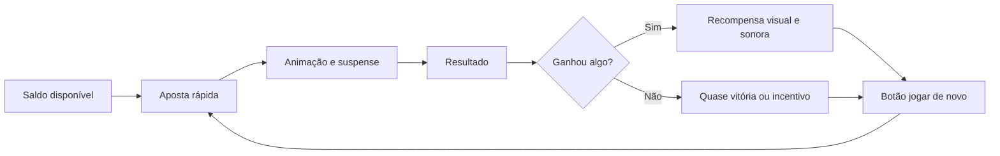

# Roteiro de Apresentação: Algoritmos, Matemática e Manipulação em Cassinos Digitais

**Público-alvo:** alunos de ETEC entre 15 e 18 anos  
**Tema:** como probabilidade, valor esperado, algoritmos e design persuasivo fazem a casa vencer no longo prazo  
**Estudo de caso fictício:** cassino digital “Tigrinho Supremo”  
**Tom:** didático, crítico, provocativo e responsável  
**Duração sugerida:** 50 a 80 minutos  
**Autor:** Manus AI

---

## 1. Ideia central da apresentação

Esta apresentação explica, de forma acessível, como cassinos digitais usam **matemática, probabilidade, estatística, lógica algorítmica e design de comportamento** para criar jogos nos quais a casa tende a ganhar no longo prazo. O objetivo não é ensinar a construir um cassino manipulador, fraudar jogos ou explorar usuários. O objetivo é fazer o caminho inverso: mostrar por que esses sistemas são desenhados para parecerem emocionantes enquanto, matematicamente, são desfavoráveis ao jogador.

O estudo de caso fictício continua sendo o **Tigrinho Supremo**, um cassino digital imaginário usado para discutir engenharia de software, front-end, mobile, ética e agora matemática. A mensagem principal é que o usuário pode até ganhar algumas rodadas, mas o sistema é desenhado para que, em média, o dinheiro caminhe lentamente em direção à casa.

> **Aviso para abrir a aula:** cassinos digitais regulados geralmente não precisam “roubar” individualmente cada usuário para lucrar. A matemática já faz o trabalho. O problema é que a interface, as notificações e os incentivos podem transformar uma desvantagem estatística em comportamento compulsivo.

---

## 2. Objetivos de aprendizagem

Ao final da apresentação, os alunos devem compreender que a vantagem da casa não depende necessariamente de trapaça explícita. Ela nasce de conceitos como **valor esperado negativo**, **RTP**, **volatilidade**, **probabilidade**, **distribuição de prêmios**, **reforço intermitente** e **design persuasivo**. A aula também deve deixar claro que sistemas de aposta podem ser tecnicamente interessantes e socialmente perigosos ao mesmo tempo.

| Objetivo | O que o aluno deve entender |
|---|---|
| Entender valor esperado | Cada aposta pode ter ganho possível, mas perda média no longo prazo. |
| Entender RTP e house edge | RTP indica retorno teórico ao jogador; house edge indica vantagem da casa. |
| Entender variância e volatilidade | Ganhos e perdas podem oscilar muito, escondendo a tendência matemática. |
| Entender RNG de forma conceitual | Resultados podem ser aleatórios, mas a tabela de pagamentos define a vantagem. |
| Reconhecer manipulação comportamental | Interface, sons, bônus e notificações podem aumentar permanência e gasto. |
| Refletir sobre ética | Matemática, produto e UX podem ser usados para explorar vulnerabilidades. |

---

## 3. Abertura: “A casa não precisa ter sorte”

**Tempo sugerido:** 5 minutos

Comece com uma pergunta simples:

> “Se um jogador pode ganhar uma aposta, por que o cassino continua rico?”

A resposta é que cassinos não dependem de vencer todas as rodadas. Eles dependem de vencer **na média**, ao longo de milhares ou milhões de apostas. Uma pessoa pode ganhar R$ 100 hoje, outra pode perder R$ 50, outra pode ganhar um prêmio grande. O que importa para a casa é que o conjunto de regras do jogo faça o retorno esperado ser positivo para ela.

**Frase de impacto:**

> “O jogador aposta contra a sorte. A casa aposta contra a estatística. Adivinha quem levou calculadora?”

---

## 4. O conceito mais importante: valor esperado

**Tempo sugerido:** 10 minutos

O **valor esperado** é uma média ponderada dos resultados possíveis. Em linguagem simples, ele responde à pergunta: se repetirmos essa aposta muitas vezes, qual é o resultado médio esperado?

A fórmula básica é:

```text
Valor Esperado = Σ(probabilidade de cada resultado × ganho ou perda daquele resultado)
```

Imagine uma aposta fictícia simples. O usuário paga R$ 10 para jogar. Existe 40% de chance de ganhar R$ 20 de volta e 60% de chance de ganhar R$ 0.

| Resultado | Probabilidade | Retorno ao jogador | Cálculo |
|---|---:|---:|---:|
| Ganha | 40% | R$ 20 | 0,40 × 20 = 8 |
| Perde | 60% | R$ 0 | 0,60 × 0 = 0 |
| Total esperado | 100% | R$ 8 | 8 + 0 = 8 |

Nesse exemplo, o jogador paga R$ 10 e recebe, em média, R$ 8 de volta. Portanto, o valor esperado líquido do jogador é:

```text
Valor esperado líquido = retorno esperado - custo da aposta
Valor esperado líquido = R$ 8 - R$ 10 = -R$ 2
```

Isso significa que, a cada aposta de R$ 10, o jogador perde em média R$ 2 no longo prazo. Ele pode ganhar uma rodada específica, mas a regra do jogo favorece a casa.

| Perspectiva | Resultado médio por rodada |
|---|---:|
| Jogador | -R$ 2 |
| Casa | +R$ 2 |

**Humor ácido:**

> “O cassino não precisa prever o futuro. Ele só precisa repetir uma conta injusta vezes suficientes.”

---

## 5. RTP e house edge: duas faces da mesma moeda

**Tempo sugerido:** 8 minutos

Em jogos de cassino, dois termos aparecem bastante: **RTP** e **house edge**. RTP significa *Return to Player*, ou retorno ao jogador. Ele representa quanto, teoricamente, o jogo devolve aos jogadores ao longo de um grande volume de apostas. Já a vantagem da casa, ou **house edge**, representa a parte que fica com o cassino.[1]

A relação é simples:

```text
House Edge = 100% - RTP
```

| RTP do jogo | House edge | Interpretação |
|---:|---:|---|
| 99% | 1% | A cada R$ 100 apostados, o retorno teórico ao conjunto dos jogadores é R$ 99. |
| 96% | 4% | A cada R$ 100 apostados, o retorno teórico ao conjunto dos jogadores é R$ 96. |
| 90% | 10% | A cada R$ 100 apostados, o retorno teórico ao conjunto dos jogadores é R$ 90. |
| 80% | 20% | A cada R$ 100 apostados, o retorno teórico ao conjunto dos jogadores é R$ 80. |

É importante explicar que RTP não é promessa individual. Um jogador pode apostar R$ 100 e perder tudo rapidamente. Outro pode ganhar um prêmio. O RTP é uma média estatística calculada sobre muitas rodadas, muitos jogadores e grande volume de apostas.

> **Mensagem didática:** se um jogo tem RTP de 96%, isso não significa que cada pessoa receberá 96% do dinheiro de volta. Significa que, no agregado e no longo prazo, o jogo foi desenhado para devolver aproximadamente esse percentual e reter o restante como vantagem da casa.

---

## 6. Exemplo visual: por que “quase justo” ainda dá lucro

**Tempo sugerido:** 6 minutos

Um RTP de 96% pode parecer generoso. Afinal, 96% parece quase tudo. Mas o segredo está no volume. Se milhões de reais são apostados, 4% vira muito dinheiro.

| Total apostado no período | RTP | Retorno teórico aos jogadores | Receita teórica da casa |
|---:|---:|---:|---:|
| R$ 10.000 | 96% | R$ 9.600 | R$ 400 |
| R$ 100.000 | 96% | R$ 96.000 | R$ 4.000 |
| R$ 1.000.000 | 96% | R$ 960.000 | R$ 40.000 |
| R$ 10.000.000 | 96% | R$ 9.600.000 | R$ 400.000 |

Explique que o cassino pensa em escala. O usuário pensa na própria rodada. A casa pensa no volume total de apostas.

**Frase de impacto:**

> “Para o jogador, 4% parece pouco. Para a casa, 4% de milhões é um abraço caloroso do Excel.”

---

## 7. RNG: aleatório não significa justo

**Tempo sugerido:** 8 minutos

Muitos jogos digitais usam geradores de números aleatórios, conhecidos como **RNG** (*Random Number Generator*). Em um sistema regulado e auditado, o RNG deve produzir resultados imprevisíveis e estatisticamente adequados.[2] Porém, um ponto essencial precisa ficar claro: **um resultado aleatório pode fazer parte de um jogo matematicamente desfavorável**.

O truque não precisa estar no sorteio. Ele pode estar na **tabela de pagamentos**.

Imagine que o sistema sorteia números de 1 a 100. O sorteio pode ser perfeitamente aleatório. Mesmo assim, a casa define quanto cada número paga.

| Faixa sorteada | Probabilidade | Pagamento ao jogador |
|---|---:|---:|
| 1 a 60 | 60% | R$ 0 |
| 61 a 90 | 30% | R$ 5 |
| 91 a 99 | 9% | R$ 20 |
| 100 | 1% | R$ 100 |

Se a aposta custa R$ 10, o retorno esperado é:

```text
(0,60 × 0) + (0,30 × 5) + (0,09 × 20) + (0,01 × 100)
= 0 + 1,50 + 1,80 + 1,00
= R$ 4,30
```

O jogador paga R$ 10 e recebe em média R$ 4,30. O valor esperado líquido é:

```text
R$ 4,30 - R$ 10 = -R$ 5,70
```

O RNG pode estar funcionando corretamente, mas o jogo continua ruim para o usuário.

| Elemento | Pode ser “justo” tecnicamente? | Ainda pode favorecer a casa? |
|---|---|---|
| Sorteio aleatório | Sim | Sim |
| Tabela de pagamentos | Sim, se declarada | Sim |
| RTP | Sim, se auditável | Sim |
| Experiência de interface | Pode ser clara ou manipuladora | Sim |

**Humor ácido:**

> “O dado pode ser honesto. A regra do jogo é que pode estar de terno, sorrindo e roubando sua carteira matematicamente.”

---

## 8. Distribuição de prêmios: o jackpot como isca estatística

**Tempo sugerido:** 8 minutos

Jogos de aposta muitas vezes usam prêmios raros e grandes para criar esperança. Isso é poderoso porque seres humanos tendem a lembrar histórias de grandes vitórias mais facilmente do que milhares de pequenas perdas invisíveis. A matemática permite criar um jogo em que existe um prêmio enorme, mas tão improvável que o valor esperado continue negativo.

| Tipo de prêmio | Frequência | Efeito no usuário |
|---|---|---|
| Pequenos retornos | Frequentes | Mantêm sensação de atividade e progresso. |
| Quase vitórias | Frequentes | Criam impressão de proximidade do prêmio. |
| Prêmios médios | Ocasional | Reforçam a ideia de que o jogo “paga”. |
| Jackpot | Muito raro | Alimenta fantasia de transformação financeira. |

Um exemplo fictício:

| Resultado | Probabilidade | Pagamento |
|---|---:|---:|
| Perda total | 70% | R$ 0 |
| Retorno pequeno | 25% | R$ 3 |
| Prêmio médio | 4,9% | R$ 20 |
| Jackpot | 0,1% | R$ 500 |

Com aposta de R$ 10, o retorno esperado é:

```text
(0,70 × 0) + (0,25 × 3) + (0,049 × 20) + (0,001 × 500)
= 0 + 0,75 + 0,98 + 0,50
= R$ 2,23
```

Mesmo com um jackpot de R$ 500, o jogador paga R$ 10 para receber, em média, R$ 2,23. A existência de um prêmio grande não torna o jogo favorável.

> **Mensagem para a turma:** jackpot não é generosidade. Muitas vezes, é marketing embalado em probabilidade baixa.

---

## 9. Volatilidade: perder devagar ou perder com montanha-russa

**Tempo sugerido:** 6 minutos

Dois jogos podem ter o mesmo RTP, mas experiências completamente diferentes. Isso acontece por causa da **volatilidade**, que descreve o tamanho e a frequência das oscilações. Um jogo de baixa volatilidade paga prêmios pequenos com mais frequência. Um jogo de alta volatilidade paga raramente, mas promete prêmios maiores.

| Tipo de jogo | Como se comporta | Efeito psicológico |
|---|---|---|
| Baixa volatilidade | Pequenos retornos frequentes | Dá sensação de controle e continuidade. |
| Alta volatilidade | Perdas longas e prêmios raros | Cria expectativa por grande virada. |
| Volatilidade média | Mistura perdas e ganhos ocasionais | Mantém engajamento sem parecer impossível. |

Explique que volatilidade não muda necessariamente a vantagem da casa. Ela muda a **sensação** do jogo. Um jogo pode parecer “pagador” porque devolve pequenas quantias frequentemente, mas ainda assim consumir saldo aos poucos.

**Frase de impacto:**

> “RTP é a conta. Volatilidade é o teatro.”

---

## 10. O ciclo da aposta: como o sistema transforma dinheiro em repetição

**Tempo sugerido:** 7 minutos

Cassinos digitais não dependem apenas da matemática de uma rodada. Eles dependem de repetição. Quanto mais rodadas o usuário joga, mais a vantagem estatística da casa aparece. Por isso, muitos sistemas reduzem fricção entre uma aposta e outra.



O ciclo é simples: facilitar aposta, criar expectativa, exibir resultado com estímulo sensorial e oferecer uma próxima rodada imediatamente. Do ponto de vista matemático, repetir uma aposta de valor esperado negativo é ruim para o jogador. Do ponto de vista do negócio, é exatamente o que aumenta receita.

| Elemento do ciclo | Função comportamental |
|---|---|
| Aposta rápida | Reduz tempo para refletir. |
| Animação | Cria suspense e emoção. |
| Som | Marca recompensa e reforça hábito. |
| Quase vitória | Sugere proximidade do prêmio. |
| Jogar de novo | Mantém o usuário no ciclo. |

---

## 11. Reforço intermitente: o cérebro não gosta só de ganhar, gosta de quase ganhar

**Tempo sugerido:** 8 minutos

Um dos conceitos mais importantes para discutir manipulação é o **reforço intermitente**. Em vez de recompensar sempre, o sistema recompensa de vez em quando, de forma imprevisível. Esse tipo de recompensa variável pode manter comportamento repetitivo com muita força, porque o usuário continua tentando em busca da próxima recompensa.[3]

Em jogos digitais, isso aparece quando pequenas vitórias, sons, luzes e “quase acertos” são distribuídos de modo a manter expectativa. O usuário não sabe quando virá a próxima recompensa. Essa incerteza alimenta repetição.

| Mecânica | Como aparece | Possível efeito |
|---|---|---|
| Recompensa variável | Ganhos imprevisíveis | Mantém expectativa. |
| Quase vitória | Dois símbolos iguais e um quase igual | Sugere que o prêmio está próximo. |
| Perda disfarçada de vitória | Ganha R$ 2 após apostar R$ 10, com animação de vitória | Confunde percepção de perda. |
| Sons de recompensa | Música positiva em retorno pequeno | Amplifica sensação de sucesso. |
| Sequências rápidas | Rodadas curtas | Reduz tempo de reflexão. |

**Exemplo importante:** se o jogador aposta R$ 10 e recebe R$ 2, ele perdeu R$ 8. Mas se a interface toca música, solta confete e mostra “Você ganhou R$ 2!”, a experiência emocional pode parecer positiva mesmo sendo uma perda líquida.

> “Quando perder R$ 8 vem com fogos de artifício, o problema não é matemática. É direção de arte a serviço da confusão.”

---

## 12. O mito da sequência: falácia do jogador

**Tempo sugerido:** 6 minutos

A **falácia do jogador** é a crença de que resultados passados alteram a chance de resultados futuros em eventos independentes. Por exemplo, se uma moeda caiu cara cinco vezes, muita gente sente que “agora deve vir coroa”. Mas, se a moeda é justa e cada lançamento é independente, a chance continua a mesma.

Em cassinos digitais, o usuário pode pensar:

> “Já perdi dez vezes, então agora deve vir uma vitória.”

Esse raciocínio é emocionalmente compreensível, mas matematicamente errado em jogos independentes. Cada rodada pode ter a mesma probabilidade, independentemente do histórico anterior.

| Pensamento comum | Problema matemático |
|---|---|
| “Estou em uma maré de azar, vai virar.” | Rodadas independentes não têm memória. |
| “Quase ganhei, então estou perto.” | Quase ganhar não muda a probabilidade da próxima rodada. |
| “O jogo está pagando hoje.” | Amostras pequenas enganam a percepção. |
| “Se eu dobrar a aposta, recupero.” | Aumenta risco de perda maior. |

**Frase de impacto:**

> “O algoritmo não sabe que você está triste. A probabilidade também não.”

---

## 13. Martingale e a ilusão de estratégia infalível

**Tempo sugerido:** 7 minutos

Uma estratégia famosa em apostas é a **Martingale**, em que a pessoa dobra a aposta depois de cada perda para tentar recuperar tudo quando finalmente ganhar. Ela parece inteligente em teoria, mas falha por três motivos: saldo limitado, limite de aposta e sequências longas de perdas.

Imagine que uma pessoa começa apostando R$ 10 e dobra após cada perda.

| Rodada | Aposta da rodada | Perda acumulada se perder |
|---:|---:|---:|
| 1 | R$ 10 | R$ 10 |
| 2 | R$ 20 | R$ 30 |
| 3 | R$ 40 | R$ 70 |
| 4 | R$ 80 | R$ 150 |
| 5 | R$ 160 | R$ 310 |
| 6 | R$ 320 | R$ 630 |
| 7 | R$ 640 | R$ 1.270 |

O crescimento é rápido. Uma sequência de perdas relativamente curta já exige muito dinheiro. Além disso, cassinos costumam ter limites de aposta, o que impede dobrar indefinidamente.

> “A Martingale é ótima até encontrar duas coisas que existem no mundo real: limite de dinheiro e limite de mesa.”

---

## 14. Algoritmos de personalização: quando o risco vira segmentação

**Tempo sugerido:** 8 minutos

Além da matemática do jogo, plataformas digitais podem usar dados de comportamento para personalizar ofertas, bônus, notificações e mensagens. Isso não significa necessariamente alterar o resultado do jogo para cada pessoa. Muitas vezes, a personalização atua ao redor do jogo: quando chamar o usuário, qual promoção mostrar, qual valor sugerir e qual mensagem parece mais convincente.

| Dado observado | Uso possível | Risco ético |
|---|---|---|
| Horário de uso | Enviar notificações no momento de maior retorno | Invadir rotina e vulnerabilidade. |
| Histórico de perdas | Oferecer bônus de recuperação | Estimular tentativa de recuperar prejuízo. |
| Frequência de depósitos | Sugerir valores maiores | Normalizar aumento de gasto. |
| Abandono no saque | Mostrar pop-up de retenção | Dificultar saída financeira. |
| Resposta a promoções | Segmentar campanhas | Explorar perfil impulsivo. |

A discussão importante é que manipulação nem sempre está no RNG. Ela pode estar no **sistema de recomendação**, no **CRM**, no **motor de campanhas**, no **front-end**, na **notificação** e na **métrica de produto**.

**Frase de impacto:**

> “O jogo pode ser aleatório. A insistência para você voltar raramente é.”

---

## 15. Bônus: dinheiro grátis que vem com coleira

**Tempo sugerido:** 7 minutos

Bônus são uma ferramenta poderosa de aquisição e retenção. Eles podem parecer dinheiro grátis, mas geralmente vêm com condições, como aposta mínima, restrições de saque, prazo de uso ou regras específicas. Em muitos casos, a pessoa precisa apostar várias vezes o valor recebido antes de conseguir sacar.

| Elemento do bônus | Como pode confundir |
|---|---|
| Valor destacado | “Ganhe R$ 100” aparece maior que as condições. |
| Requisitos de aposta | Usuário precisa apostar múltiplas vezes antes de sacar. |
| Prazo curto | Pressiona decisões rápidas. |
| Jogos elegíveis | Nem todo jogo conta para cumprir requisito. |
| Limite de saque | O ganho real pode ser limitado. |

Exemplo didático fictício:

```text
Bônus: R$ 100
Rollover: 20x
Valor que precisa ser apostado antes do saque: R$ 2.000
```

Nesse caso, o usuário recebe R$ 100, mas precisa movimentar R$ 2.000 em apostas antes de liberar o saque. Se cada aposta tem valor esperado negativo, o bônus pode funcionar como incentivo para exposição prolongada ao risco.

> “Dinheiro grátis com vinte páginas de regra geralmente não é presente. É contrato fantasiado de confete.”

---

## 16. Manipulação de percepção: ganhar, perder e “quase” ganhar

**Tempo sugerido:** 6 minutos

A interface pode alterar a forma como o usuário percebe resultados. O objetivo de uma interface responsável seria mostrar o resultado líquido com clareza. Uma interface manipuladora pode destacar ganhos brutos e esconder perdas líquidas.

| Situação real | Apresentação manipuladora | Apresentação responsável |
|---|---|---|
| Apostou R$ 10 e recebeu R$ 2 | “Você ganhou R$ 2!” | “Resultado: retorno de R$ 2. Perda líquida: R$ 8.” |
| Perdeu várias rodadas | “Você está quase!” | “Você perdeu R$ 50 nas últimas 10 rodadas.” |
| Recebeu bônus condicionado | “R$ 100 grátis!” | “Bônus de R$ 100 com requisito de aposta de R$ 2.000.” |
| Jackpot raro | “Alguém ganhou hoje!” | “Probabilidade individual de jackpot: extremamente baixa.” |

A clareza sobre perda líquida é um ponto fundamental. Se o sistema mostra apenas o que voltou, mas não mostra o que foi gasto, ele distorce a percepção financeira.

---

## 17. Simulação mental: muitas pessoas, muitas rodadas

**Tempo sugerido:** 6 minutos

Para fixar a ideia, proponha uma simulação mental. Imagine 1.000 alunos jogando uma rodada de R$ 10 em um jogo com RTP de 90%.

| Item | Valor |
|---|---:|
| Número de jogadores | 1.000 |
| Aposta por jogador | R$ 10 |
| Total apostado | R$ 10.000 |
| RTP | 90% |
| Retorno esperado aos jogadores | R$ 9.000 |
| Receita esperada da casa | R$ 1.000 |

Agora imagine que cada aluno joga 100 rodadas.

| Item | Valor |
|---|---:|
| Total de apostas | 100.000 apostas |
| Volume financeiro | R$ 1.000.000 |
| Retorno esperado aos jogadores | R$ 900.000 |
| Receita esperada da casa | R$ 100.000 |

Explique que a casa gosta de repetição porque a média aparece com mais força quando o volume aumenta. Para uma pessoa, o curto prazo parece sorte ou azar. Para a casa, o longo prazo parece planejamento.

**Frase de impacto:**

> “O jogador vive uma história. A casa administra uma planilha.”

---

## 18. O que seria uma apresentação honesta de risco?

**Tempo sugerido:** 6 minutos

Uma interface responsável deveria explicar risco, custo e probabilidade de modo compreensível. O problema é que isso pode reduzir conversão. Então surge o conflito entre ética e métrica.

| Informação | Forma honesta de mostrar |
|---|---|
| RTP | “Este jogo tem retorno teórico de 90% no longo prazo.” |
| House edge | “A vantagem estatística da casa é de 10%.” |
| Perda líquida | “Você apostou R$ 100 hoje e recebeu R$ 72 de volta. Resultado líquido: -R$ 28.” |
| Bônus | “Para sacar, será necessário apostar R$ 2.000.” |
| Tempo de uso | “Você está jogando há 45 minutos.” |
| Limites | “Defina um limite antes de continuar.” |

**Pergunta para a turma:**

> “Se mostrar tudo isso com clareza reduz o lucro, a empresa ainda deveria mostrar?”

Essa pergunta abre espaço para discutir responsabilidade profissional. Desenvolvedores, designers e gerentes de produto podem ser pressionados a esconder fricções. A maturidade técnica inclui perceber quando uma decisão de interface prejudica a autonomia do usuário.

---

## 19. O que não fazer: diferença entre explicar e ensinar exploração

**Tempo sugerido:** 4 minutos

É importante reforçar uma fronteira ética. Estudar a matemática e os padrões de manipulação serve para criar consciência, auditoria, regulação, prevenção e educação. Não deve ser usado para construir sistemas predatórios.

| Abordagem educativa | Abordagem antiética |
|---|---|
| Explicar valor esperado e risco. | Ajustar sistema para explorar perfis vulneráveis. |
| Mostrar como dark patterns funcionam. | Implementar dark patterns para aumentar perdas. |
| Ensinar leitura crítica de bônus. | Esconder condições em linguagem confusa. |
| Discutir RNG e auditoria. | Manipular resultados individualmente. |
| Criar alertas de limite e pausa. | Enviar incentivo após perdas. |

> “Conhecer o truque não é licença para aplicá-lo. É responsabilidade para não cair nele — e para não vendê-lo como produto.”

---

## 20. Atividade prática: desmontando um jogo fictício

**Tempo sugerido:** 10 a 15 minutos

Divida a turma em grupos e apresente este jogo fictício:

> “Cada rodada custa R$ 5. Existe 50% de chance de retorno zero, 35% de chance de retorno de R$ 2, 14% de chance de retorno de R$ 10 e 1% de chance de retorno de R$ 100.”

Peça para os grupos calcularem o retorno esperado.

| Resultado | Probabilidade | Retorno | Cálculo |
|---|---:|---:|---:|
| Perda total | 50% | R$ 0 | 0,50 × 0 = 0 |
| Retorno pequeno | 35% | R$ 2 | 0,35 × 2 = 0,70 |
| Prêmio médio | 14% | R$ 10 | 0,14 × 10 = 1,40 |
| Prêmio raro | 1% | R$ 100 | 0,01 × 100 = 1,00 |
| Total esperado | 100% | — | R$ 3,10 |

Como a rodada custa R$ 5, o valor esperado líquido é:

```text
R$ 3,10 - R$ 5,00 = -R$ 1,90
```

| Indicador | Valor |
|---|---:|
| Custo da rodada | R$ 5,00 |
| Retorno esperado | R$ 3,10 |
| Valor esperado líquido do jogador | -R$ 1,90 |
| RTP | 62% |
| House edge | 38% |

Depois, peça que eles respondam:

| Pergunta | Discussão esperada |
|---|---|
| O jogo parece atraente por quê? | O prêmio de R$ 100 chama atenção. |
| O jogo é bom para o jogador? | Não, o valor esperado é negativo. |
| Qual elemento visual poderia manipular percepção? | Destaque do prêmio raro e animações de quase vitória. |
| Como apresentar de forma honesta? | Mostrar custo, RTP, perda líquida e probabilidade. |

---

## 21. Roteiro sugerido de slides

| Slide | Título | Conteúdo principal |
|---|---|---|
| 1 | A Casa Não Precisa Ter Sorte | Abertura e ideia central. |
| 2 | Aviso ético | Explicar para conscientizar, não para explorar. |
| 3 | Por que cassinos lucram? | Longo prazo, volume e vantagem estatística. |
| 4 | Valor esperado | Fórmula simples e exemplo. |
| 5 | RTP e house edge | Relação entre retorno ao jogador e vantagem da casa. |
| 6 | “Quase justo” ainda dá muito dinheiro | Volume apostado e receita esperada. |
| 7 | RNG não salva o jogador | Aleatório não significa favorável. |
| 8 | Tabela de pagamentos | Onde a vantagem é desenhada. |
| 9 | Jackpot como isca estatística | Prêmio raro e valor esperado negativo. |
| 10 | Volatilidade | Mesma média, experiências diferentes. |
| 11 | Ciclo da aposta | Repetição, animação, resultado e nova rodada. |
| 12 | Reforço intermitente | Recompensas variáveis e comportamento. |
| 13 | Quase vitória e perda disfarçada | Manipulação de percepção. |
| 14 | Falácia do jogador | A ilusão de que “agora vai”. |
| 15 | Martingale | Estratégia que quebra no mundo real. |
| 16 | Personalização e notificações | Manipulação ao redor do jogo. |
| 17 | Bônus e rollover | Dinheiro grátis com condições. |
| 18 | Simulação com 1.000 jogadores | A casa administra volume. |
| 19 | Interface honesta de risco | Como mostrar probabilidade e perda líquida. |
| 20 | Atividade prática | Calcular RTP e house edge de um jogo fictício. |
| 21 | Conclusão | Matemática, produto e ética. |

---

## 22. Possível fala de abertura pronta

“Hoje a gente vai falar sobre uma das partes mais importantes dos cassinos digitais: a matemática. Não a matemática bonita do vestibular, mas a matemática que sorri, toca musiquinha e pega seu dinheiro em parcelas pequenas. A pergunta da aula é: se algumas pessoas ganham, por que a casa sempre ganha no final? A resposta está em valor esperado, RTP, vantagem da casa, volatilidade e repetição. E também está em interface, notificação, bônus e manipulação de percepção. A casa não precisa ganhar todas. Ela só precisa que você jogue o suficiente.”

---

## 23. Possível fala de encerramento pronta

“Se vocês lembrarem de uma coisa desta aula, lembrem disso: ganhar uma rodada não significa vencer o sistema. A matemática de um cassino é desenhada para funcionar no agregado, no longo prazo e em grande volume. O usuário vê emoção, quase vitória, bônus e animação. A casa vê probabilidade, margem, retenção e receita esperada. Como profissionais de tecnologia, vocês precisam entender que algoritmo não é neutro quando ele organiza risco, dinheiro e comportamento humano. Saber matemática não serve só para calcular lucro. Serve também para reconhecer exploração.”

---

## 24. Piadas e frases de impacto

| Frase | Momento ideal |
|---|---|
| “O jogador aposta contra a sorte. A casa aposta contra a estatística.” | Abertura. |
| “O cassino não prevê o futuro; ele repete uma conta injusta.” | Valor esperado. |
| “RTP é a conta. Volatilidade é o teatro.” | Volatilidade. |
| “O dado pode ser honesto; a regra pode ser cruel.” | RNG e tabela de pagamentos. |
| “O jogador vive uma história. A casa administra uma planilha.” | Simulação em escala. |
| “Dinheiro grátis com vinte páginas de regra é contrato fantasiado de confete.” | Bônus. |
| “O algoritmo não sabe que você está triste. A probabilidade também não.” | Falácia do jogador. |
| “A casa não precisa ganhar todas. Só precisa que você continue.” | Conclusão. |

---

## 25. Mini-glossário

| Termo | Explicação simples |
|---|---|
| Valor esperado | Média matemática esperada após muitas repetições de uma aposta. |
| RTP | Percentual teórico que o jogo devolve aos jogadores no longo prazo. |
| House edge | Vantagem estatística da casa sobre o jogador. |
| RNG | Gerador de números aleatórios usado para sortear resultados. |
| Tabela de pagamentos | Regra que define quanto cada resultado paga. |
| Volatilidade | Intensidade das oscilações entre perdas e ganhos. |
| Jackpot | Prêmio raro e grande, usado para atrair atenção. |
| Reforço intermitente | Recompensas imprevisíveis que incentivam repetição. |
| Quase vitória | Resultado que parece próximo do prêmio, mesmo sendo perda. |
| Falácia do jogador | Crença errada de que resultados passados alteram eventos independentes. |
| Martingale | Estratégia de dobrar aposta após perdas, limitada por saldo e limites. |
| Rollover | Exigência de apostar várias vezes antes de sacar um bônus. |

---

## 26. Checklist crítico para analisar cassinos digitais

| Pergunta | Por que importa |
|---|---|
| Qual é o RTP do jogo? | Mostra o retorno teórico ao jogador. |
| Qual é a vantagem da casa? | Mostra a margem matemática do cassino. |
| O jogo mostra perda líquida? | Ajuda o usuário a perceber o resultado real. |
| Existem quase vitórias frequentes? | Podem distorcer percepção de chance. |
| O app envia notificações após perdas? | Pode explorar vulnerabilidade emocional. |
| O bônus tem rollover? | Pode obrigar exposição prolongada ao risco. |
| O saque é mais difícil que o depósito? | Pode indicar obstrução de saída. |
| A interface mostra probabilidades claramente? | Permite decisão informada. |
| O histórico mostra total apostado, ganho e perdido? | Ajuda consciência financeira. |
| Há limites de gasto e pausa acessíveis? | Protege autonomia e controle. |

---

## 27. Conclusão geral

Cassinos digitais são uma combinação poderosa de matemática, software, design e comportamento humano. A casa tende a ganhar porque os jogos são construídos com valor esperado negativo para o jogador. O RNG pode ser aleatório, a interface pode parecer divertida e algumas pessoas podem ganhar prêmios, mas a estrutura geral favorece o operador no longo prazo.

O risco aumenta quando essa matemática é combinada com notificações insistentes, bônus condicionados, quase vitórias, perdas disfarçadas de vitórias e fluxos de interface que tornam apostar fácil e parar difícil. Nesse ponto, o problema deixa de ser apenas estatístico e passa a ser ético.

> “A matemática explica como a casa ganha. O design explica por que o jogador continua tentando.”

---

## 28. Referências úteis para aprofundamento

[1]: https://www.gamblingcommission.gov.uk/licensees-and-businesses/guide/page/return-to-player-rtp-information "UK Gambling Commission — Return to Player (RTP) information"  
[2]: https://www.gaminglabs.com/services/igaming/ "Gaming Laboratories International — iGaming testing and certification"  
[3]: https://www.britannica.com/science/operant-conditioning "Encyclopaedia Britannica — Operant conditioning"  
[4]: https://www.ncpgambling.org/help-treatment/faqs-what-is-problem-gambling/ "National Council on Problem Gambling — What is problem gambling?"  
[5]: https://www.deceptive.design/ "Deceptive Design — Types of deceptive patterns"  
[6]: https://www.nngroup.com/articles/dark-patterns/ "Nielsen Norman Group — Dark Patterns in UX"  
[7]: https://developer.mozilla.org/en-US/docs/Web/API/Push_API "MDN Web Docs — Push API"  
[8]: https://www.w3.org/WAI/standards-guidelines/wcag/ "W3C — Web Content Accessibility Guidelines (WCAG)"  
[9]: https://www.iso.org/standard/40146.html "ISO/IEC 27001 — Information security management systems"  
[10]: https://www.oecd.org/digital/ieconomy/consumer-policy-in-the-digital-age.pdf "OECD — Consumer Policy in the Digital Age"

References: [1], [2], [3], [4], [5], [6], [7], [8], [9], [10]
